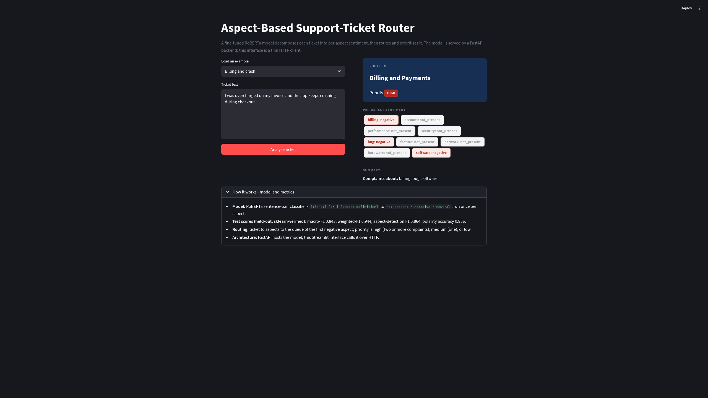
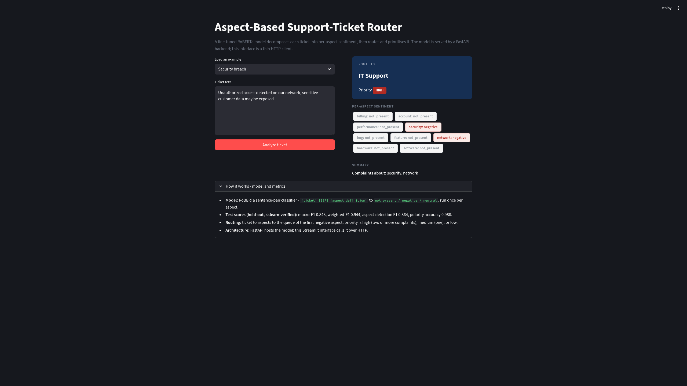
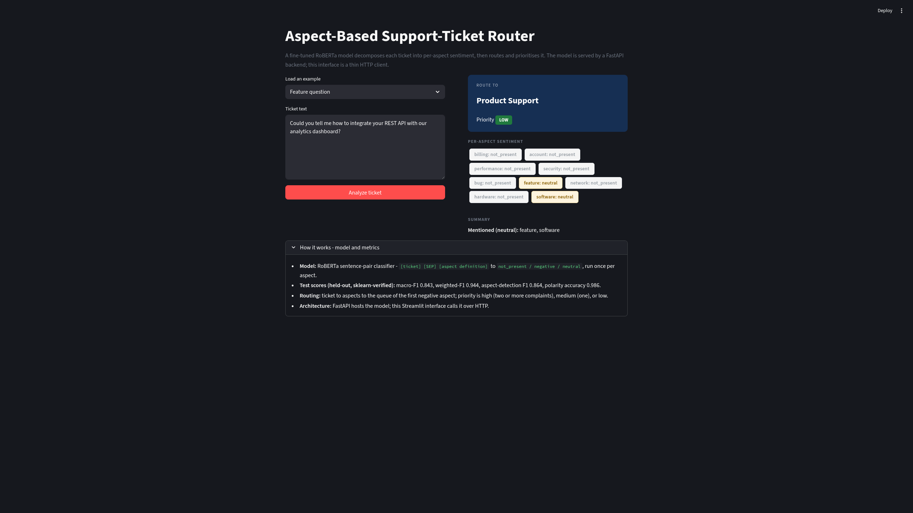
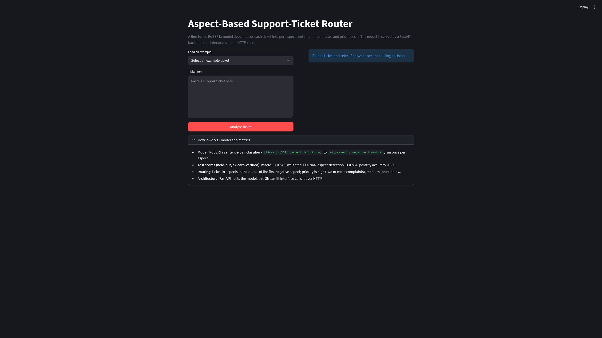

# Phase 7 - Serving

[< 06 Results & Experiments](06-results-and-experiments.md) · [docs index](README.md)

---

The model is exposed as a service, with a thin UI that calls it - not a monolith that
loads the model in the frontend.

## 7.1 Inference core - `app/predict.py`

One function, `predict(body)`, that:
1. runs the RoBERTa model once per aspect (sentence-pair: body + aspect definition),
2. returns the per-aspect sentiment for all 9 aspects,
3. derives a **route**: the queue of the first negative aspect (falls back to any
   present aspect, else General Inquiry),
4. derives a **priority**: high (two or more complaints), medium (one), low (none).

This is the single code path used by both the API and the notebook demo.

## 7.2 API - `app/api.py` (FastAPI)

| endpoint | method | purpose |
|---|---|---|
| `/predict` | POST | `{"body": "..."}` to per-aspect sentiment + route + priority |
| `/health` | GET | liveness + the aspect list |

The model is loaded once, in the API process. Run: `uvicorn app.api:app --port 8000`.
Verified over real HTTP:

```
POST /predict {"body": "I was overcharged and the app keeps crashing"}
to  route: "Billing and Payments", priority: "high",
    negatives: ["billing", "bug", "software"]
```

## 7.3 UI - `app/streamlit_app.py`

A **thin HTTP client**. It does **not** load the model - it sends requests to the API
(`ABSA_API_URL`, default `http://localhost:8000`). This is the correct client-server
split: one model instance in the API, any number of UI clients.

The UI shows the routing decision, a priority badge, and per-aspect sentiment chips,
with a graceful message if the backend is unreachable.

### Examples (live, from the running stack)

Multi-aspect complaint - billing overcharge plus an app crash - split into three
negative aspects, routed to Billing, high priority:



A security breach routes to IT Support; a how-to question is correctly read as a
neutral inquiry (not a complaint) and routed to Product Support, low priority:

| Security breach | Feature question |
|---|---|
|  |  |

Initial / empty state:



## 7.4 Containerization

| file | purpose |
|---|---|
| `Dockerfile` | the FastAPI service (CPU torch to keep the image small) |
| `Dockerfile.streamlit` | the thin UI client (no torch needed) |
| `docker-compose.yml` | runs both; UI waits on the API health check; model mounted in |

```bash
docker compose up --build      # API on :8000, UI on :8501
```

## 7.5 Persisted artifacts

| artifact | format | why |
|---|---|---|
| `models/roberta-absa/` | HF safetensors | native transformers format (correct for a torch model) |
| `models/tfidf/*.joblib` | joblib | the sklearn baseline (vectorizer + 9 classifiers) |

The RoBERTa model is intentionally **not** pickled - pickling a torch model is fragile;
safetensors is the right format.

---

**Artifacts:** `app/` (predict, api, streamlit), `Dockerfile`, `Dockerfile.streamlit`,
`docker-compose.yml`, `models/`.
